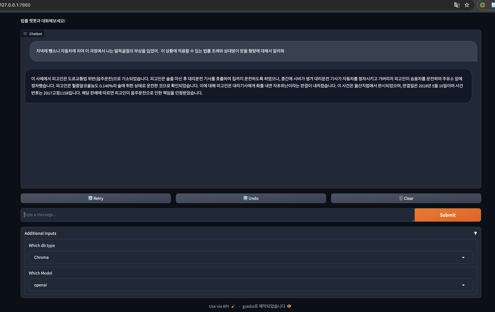

# 법률 챗봇 

이 프로젝트는 법원 판례 데이터(AIhub)를 벡터DB에서 읽어와서 LangChain과 RAG(Retrieval-Augmented Generation) 기술을 이용하여 사용자의 질문에 대해 법률적인 조언을 제공하는 챗봇을 구현합니다.
<br/>
Gradio를 이용해 사용자 친화적인 웹 인터페이스를 제공하여 쉽게 접근하고 사용할 수 있습니다.

## 기능

- **법률 정보 검색**: 사용자의 질문에 맞는 법원 판례를 벡터DB에서 검색합니다.
    - **ChromaDB**, **FAISS DB** 두개의 DB를 구성하여 성능 비교 가능
    - make_chroma or make_faiss 함수를 이용해 vector db 생성, data_path 설정할 것 
    [데이터셋 : 법률/규정 (판결서, 약관 등) 텍스트 분석 데이터](https://aihub.or.kr/aihubdata/data/view.do?currMenu=&topMenu=&aihubDataSe=data&dataSetSn=580)

- **모델 선택 가능**: OpenAI의 모델과 Huggingface의 모델을 local에 저장하여 사용
    (huggingface의 모델은 langchain에 담지 못하여 model.generate를 이용하여 답변 생성)
    - model_name : "TeamUNIVA/Komodo_7B_v1.0.0" (local gpu에 올라가지 않아: 4bit 양자화 후 사용)
    - embedding_model_name : "jhgan/ko-sroberta-multitask"
- **정확한 답변 제공**: RAG 기술을 이용해 관련 법률 정보를 통합하고, 이를 기반으로 사용자 질문에 답변합니다.
- **사용자 친화적 웹 인터페이스**: Gradio를 통해 제공되는 웹 인터페이스를 통해 간단하게 정보를 요청하고 답변을 받을 수 있습니다.

## Pipeline

<div>
  <p>1. 설명: 이 단계에서는 사용자가 Gradio에서 Model과 DB종류를 선택하고 질문을 입력한다. 이후 입력에 기반하여 데이터베이스에서 관련 정보를 추출하는 RAG 기술을 사용</p>
  
</div>
<div>
  <p>2. 설명: RAG 기술을 기반으로 추출된 데이터와 함께 프롬프트 엔지니어링을 진행</p>
  
</div>
<div>
  <p>3. 설명: 선택한 모델에 프롬프트를 입력으로 넣고 생성된 문장을 출력한다.</p>
  
</div>

#### 데모화면


## 설치 방법

이 프로젝트를 로컬 환경에서 실행하기 위해 다음 단계를 따라주세요.
if. openai 모델을 이용하실 경우 root경로의 .env파일에 
```
OPENAI_API_KEY = "your_key"
```

```bash
git clone https://github.com/your-repository/legal-chatbot.git
cd legal-chatbot
pip install -r requirements.txt
python 'make_chroma.py' or 'make_faiss.py' 
python main.py
```

### 문의사항
더 궁금한 사항이 있으시면 gksthdgns3@naver.com으로 연락주세요.